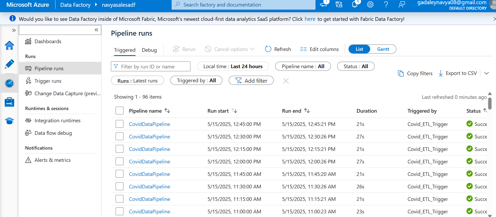

# COVID-19 Azure Power BI Dashboard

End-to-end COVID-19 analytics solution using Azure Data Factory, Azure SQL Database, and Power BI.

## 🚀 Project Overview

This project demonstrates how to build a scalable cloud-based ETL and reporting pipeline. It extracts COVID-19 data, loads it into Azure SQL via Data Factory, and visualizes it in Power BI.

## 🔧 Tech Stack

- **Azure Data Factory** – ETL orchestration and scheduling
- **Azure SQL Database** – Central data storage
- **Power BI** – Interactive dashboards
- **GitHub** – Version control and project documentation

## 📊 Dashboard Pages

| Page | Description |
|------|-------------|
| Page 1 | Global KPI cards + country filter |
| Page 2 | Country comparison via bar chart |
| Page 3 | Drillthrough insights per country and date |

## 📸 Screenshots

| Pipeline Trigger | Azure SQL Table |
|------------------|-----------------|
|  |  |

| Power BI Dashboards |
|---------------------|
|  |
|  |
|  |

## 📂 Files

- `ADFCovidcases_Updated.pbix` – Power BI file
- `Pipeline_creation.png` – ADF pipeline config
- `README.md` – Project overview

## 🧠 Learning Outcomes

- Built a cloud ETL pipeline from scratch
- Automated data refresh with ADF triggers
- Visualized trends and drilldowns using DAX & Power BI

## 📎 Useful Links

- https://www.linkedin.com/in/gadaley-navya-sri-4b5aa81ba/ [LinkedIn]
- https://github.com/navyasri0820/covid19-azure-powerbi-dashboard.git [github Portfolio Project]

